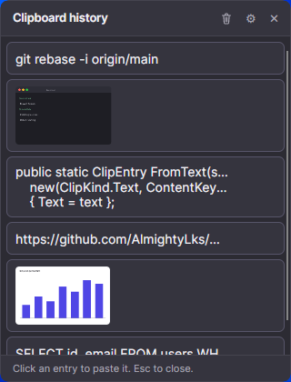

# UtilV

A clipboard history for Linux, in the spirit of Windows' <kbd>Win</kbd>+<kbd>V</kbd>.

Press your shortcut, a small popup opens at the cursor, click an entry, and it is pasted
into whatever you were typing in. Text and images, pinning, and nothing written to disk.



## Features

- Captures text and images copied by any application
- Popup opens at the mouse cursor and closes when it loses focus
- One click copies the entry, pastes it, and moves it back to the top of the list
- Pin entries to keep them above the rest and exempt from the history limit
- Configurable history length and maximum entry size
- History and pins live in memory only, and are gone when UtilV exits
- Single window, no background database, no telemetry

## What gets captured

**Text and images only.**

- **Text**, including multi-line snippets, which keep their line breaks in the list
- **Images** copied from an editor, a browser or a screenshot tool, shown as a thumbnail

**Copied files are not supported.** Selecting a file in your file manager and pressing
<kbd>Ctrl</kbd>+<kbd>C</kbd> puts a *reference* to the file on the clipboard, not its
contents. UtilV never captures the file, so copying an image file does not add the image
to the history. Open it and copy the image itself to do that.

Nothing breaks if you copy a file: UtilV does not take the clipboard over, so pasting into
your file manager still works as it always did. Depending on the file manager, the entry
may not appear in the history at all, or may appear as the file's path in text form.

Rich text, HTML and other formats are captured as their plain-text equivalent.

## Requirements

- X11 (Wayland is not supported)
- `libX11`, `libXfixes` and `libXtst`, which any X11 desktop already has

The release is self-contained, so no .NET runtime is needed.

## Installation

Download the latest release from the
[releases page](https://github.com/AlmightyLks/UtilV/releases/latest), extract it, and run
the installer:

```bash
tar xzf utilv-linux-x64.tar.gz
cd utilv-linux-x64
./install.sh
```

It shows where it is about to install and asks before doing anything. By default UtilV
goes to `~/.local/lib/utilv`, with a symlink at `~/.local/bin/utilv` so it can be run as a
plain `utilv` command, and a systemd user service so it starts with your desktop session.

```
--prefix DIR   install somewhere other than ~/.local
--no-service   install the program only, and start it yourself
```

To remove it again, run `./uninstall.sh` from the same directory. Both scripts are also
installed alongside the program.

If you would rather not use the service, start UtilV yourself with `utilv &`, or add it to
your desktop's startup applications.

## The shortcut

<kbd>Alt</kbd>+<kbd>V</kbd> works as soon as UtilV is running. There is nothing to
configure: the combination is registered with the X server itself, not with your desktop,
so it behaves the same under every X11 window manager.

Only one program can hold a combination at a time. If something else already has
<kbd>Alt</kbd>+<kbd>V</kbd>, UtilV says so on startup and carries on without it. Either
free the combination in that program, or bind a key of your choice to this command in your
desktop's keyboard settings:

```
utilv --toggle
```

That command also appears in UtilV's settings pane, with a button to copy it.

## Command line

```
utilv            run in the background
utilv --toggle   show or hide the popup
utilv --help     usage and shortcut instructions
```

Only one instance runs at a time. Launching a second one toggles the first instead, over a
Unix socket in `$XDG_RUNTIME_DIR`.

Settings are stored in `~/.config/utilv/settings.json`. The history itself is never
written to disk.

Set `UTILV_DIAG` to a file path to trace what the clipboard service is doing:

```bash
UTILV_DIAG=/tmp/utilv.log utilv
```

## Built with

[Avalonia](https://avaloniaui.net) on .NET 10, published ahead-of-time.
